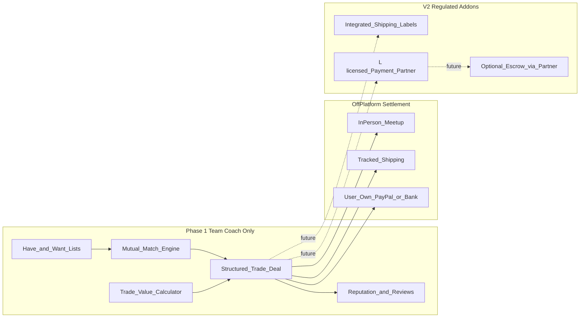

# Collectible Card Trading Platform — Concept & Compliance Plan

> Australia-first collectible card trading platform. Phase 1: AFL Team Coach only. Phase 1b: Pokemon + MTG. Matching-only coordination in early phases to minimize AML/CTF exposure.

## What collectors actually do today

Research across Discord, Reddit, Facebook, LGS trade nights, and dedicated apps shows **7 distinct trading patterns**. Your platform should support all of them conceptually, but **not all in Phase 1**.

| Pattern | How it works today | Pain points | Examples |
|---|---|---|---|
| **1. Pure card-for-card** | Two people swap equal-ish value stacks | Hard to find someone who wants exactly what you have | Discord middlemen, LGS nights |
| **2. Card + cash differential** | Lower-value side adds cash to balance market value | Disputes over price source, condition, and fairness | Trade calculators, vendor tables |
| **3. Buy/sell disguised as trade** | "Trade" posts that are really sales | Blurs trade vs sale; scam risk on Facebook | eBay, TCGPlayer, Misprint |
| **4. Matcher-only platforms** | App finds overlapping want/have lists; users finish off-platform | No shipment protection; trust is external | [Catchinary](https://catchinary.com/trades), [TCG Buddy](https://www.tcg-buddy.com/) |
| **5. Chat-first communities** | WTB/WTS/WTT posts + DMs | Fragmented, no structured deal state | [CardCircuit](https://cardcircuit.co.uk/) |
| **6. Escrow marketplaces** | Platform holds buyer funds until delivery confirmed | Higher trust, but higher regulatory burden | [Cardpeer](https://cardpeer.com/), [HoardGate](https://www.hoardgate.com/) |
| **7. In-person / LGS** | Inspect cards, trade on the spot | Safe for condition; limited reach | Pokemon League, trade nights |

**Australia-specific context:** Most AU collectors already use **Facebook groups, Discord, Reddit (`r/pkmntcgtrades`), and local game stores**. Online mail trades often settle via **PayPal G&S, bank transfer, or cash at meetups**. There is no dominant AU-native "trade-first" platform — that is your gap.

**AFL Team Coach context:** [Team Coach](https://www.teamcoach.com.au/) is the official AFL footy trading card game (2026 season active now). Packs are ~$4.99 RRP, sold via AFL club stores and AU retailers ([Funporium](https://funporium.com.au/collections/afl-2026-teamcoach-trading-cards), [Footy Cards](https://footycards.com.au/2026-en/2026-afl-teamcoach/)). The 2026 set has ~798 cards across base sets (Bronze/Silver/Gold), inserts (Star Powers, Wildcards, Card Craft, Best & Fairest, Footy Flix, Scanlens, etc.), and online game tie-ins. Trading happens heavily **in schools, at footy grounds, and in Facebook groups** — but there is no structured matcher. The official site offers a [Card Directory](https://www.teamcoach.com.au/) and downloadable checklists, which are the best catalog seed sources.

| Team Coach trading pattern | What collectors need | Platform opportunity |
|---|---|---|
| **Schoolyard / local swaps** | Quick 1-for-1 trades of duplicates | Meetup mode + club filters (e.g. "Richmond collectors near Melbourne") |
| **Checklist completion** | Fill missing base numbers for a team or full 270-card base set | Want-list auto-generated from checklist gaps |
| **Card Craft chase** | Collect Action + Cheering + Portrait + Gold Collage for one player to craft a 24k gold-plated card | Dedicated **Card Craft matcher** — find users who have your missing piece and need yours |
| **Insert chasing** | Star Powers, Magic Wildcards, Best & Fairest by player/club | Parallel-aware matching (same player, different insert series) |
| **Cross-category trades** | "I'll swap my footy Star Power for your Pokemon ex" | Deferred to **Phase 1b** when TCG catalogs ship |

---

## Recommended product thesis

Build **"Catchinary for AFL Team Coach"** first — fair-trade tooling + AU shipping workflow — then expand to TCGs in Phase 1b.

Core promise:

- **Find trade partners faster** (automated mutual matching)
- **Agree on fair value before shipping** (shared trade calculator + condition rules)
- **Complete trades with less scam risk** (identity, reputation, structured deal flow)
- **Stay out of money-laundering territory** by not becoming an unregulated payments/escrow business in Phase 1

---

## Recommended scope (Australia-first)

### Phase 1 — AFL Team Coach 2026 only

Launch narrow and own the footy card trading niche while the 2026 season is hot. No Pokemon, MTG, or cross-system trades in Phase 1.

**Why Team Coach first:**

- No existing AU trade matcher (unlike Pokemon via Catchinary)
- Strong seasonality — launch while 2026 packs are in AFL club stores and schools
- Smaller, bounded catalog (~798 cards) vs open-ended TCG APIs
- Card Craft matcher is a clear differentiator the official [Team Coach site](https://www.teamcoach.com.au/) does not offer

**Catalog (Phase 1):**

| System | Data source | Pricing reference |
|---|---|---|
| **AFL Team Coach 2026** | Official [2026 checklist download](https://www.teamcoach.com.au/) + Card Directory; manual/admin seed (no public API) | AU retailer comps ([Funporium](https://funporium.com.au/collections/afl-2026-teamcoach-trading-cards), eBay AU sold listings); user-reported values for rare inserts |

> **Note:** Before scraping Team Coach's card directory at scale, confirm terms of use or request permission. Safer v1 path: import the official downloadable checklist and crowdsource card images from user uploads during listing.

### Phase 1b — Pokemon + MTG (after Team Coach core is live)

Add once Phase 1 match/deal workflow is proven (target: 4–6 weeks after Phase 1 launch):

| System | Data source | Pricing reference |
|---|---|---|
| **Pokemon TCG** | Pokemon TCG API | TCGPlayer with AUD display |
| **Magic: The Gathering** | Scryfall | TCGPlayer / Cardmarket with AUD display |
| **Yu-Gi-Oh!** | YGOProDeck | Phase 2 expansion |

**Phase 1b also enables:**

- Cross-system trades (Team Coach ↔ Pokemon) with shared value calculator
- Broader "collectible cards" positioning beyond footy

**Deferred beyond Phase 1b:** One Piece, Lorcana, and other TCGs until catalog + pricing feeds are stable.

### Core user objects

- **Collection / trade binder** — cards marked `Have`, `Want`, or `Not for trade` (Phase 1: Team Coach only; schema supports future systems)
- **Trade offer** — multi-card bundle on each side + optional cash differential (displayed, not processed in Phase 1)
- **Match score** — mutual overlap + value balance + condition compatibility + shipping distance (AU state/postcode)
- **Trade deal** — state machine: `Proposed → Accepted → Shipped → Received → Completed / Disputed`
- **Trader profile** — verified identity tier, trade history, ratings, dispute rate; optional **AFL club affiliation** and **favourite team** for Team Coach community discovery

### Team Coach-specific Phase 1 features

**1. Checklist-driven want lists**

- User selects their target: full base set, team set (e.g. "Collingwood base"), or Card Craft player
- Platform auto-generates want list from official checklist minus cards already marked `Have`
- Progress bar: "142/270 base cards" or "2/4 Card Craft pieces for Nick Daicos"

**2. Card Craft matcher (differentiator)**

- For a chosen player, find traders who have one of your missing pieces (Action / Cheering / Portrait / Gold Collage) and want one of yours
- Rank matches where both users advance toward a complete Card Craft set

**3. Team Coach listing fields**

- Required: season (2026), series (Base / Star Powers / Card Craft / Wildcards / etc.), card number, player, club
- Parallel tier where applicable: Bronze / Silver / Gold
- Condition grades adapted for sports cards: Mint, Near Mint, Played (simpler than TCG grading for Phase 1)

**4. AU footy community filters**

- Filter matches by AFL club, state, "school-friendly meetups only" (parent-supervised trades for younger collectors)
- Seasonal rooms/channels aligned with AFL rounds (mirrors the round-based energy on [teamcoach.com.au](https://www.teamcoach.com.au/))

### Features that directly solve real trading pain

**1. Mutual match engine (the killer feature)**

- Solve the **double coincidence of wants**: User A wants a Star Powers Daicos; User B wants your Scanlens Wildcard; both have what the other needs
- Rank matches by:
  - Mutual card overlap
  - Value balance (within configurable tolerance, e.g. 10%)
  - Condition floor (Mint / Near Mint / Played)
  - AU proximity (same state / metro for meetups)
  - Card Craft completion score (boost users who help each other finish a craft set)

**2. Shared trade calculator (trust layer)**

- Both sides see the same reference prices (AU retailer comps + eBay AU sold listings for Team Coach; TCGPlayer in Phase 1b)
- Show **WIN / FAIR / LOSE** balance like existing trade calculators ([MtgFrame](https://mtgframe.com/trade-calculator))
- Lock the agreed valuation snapshot into the trade deal record at acceptance time

**3. Structured WTT posts (better than Discord walls)**

- Post types: **WTT**, **WTB**, **WTS** — Phase 1 optimizes for **WTT**
- Required fields: season, series, card number, player, club, condition, photos for $20+ reference value
- AU filters: `Ship nationwide`, `Meetup in [city]`, `Registered post only`

**4. Deal workflow for mail trades (no platform custody)**

- Generate a **trade agreement summary** both users accept
- Checklist: photos uploaded, shipping method agreed, tracking numbers exchanged
- Timers/nudges: "Mark shipped within 3 days" / "Confirm receipt within 7 days"
- Dispute flow: evidence upload + moderation queue (platform resolves reputation, not funds in Phase 1)

**5. In-person trade mode**

- Meet at AFL club store, school gate, or public place
- QR code to confirm both parties accepted the same card list on-site
- Lower fraud risk; ideal for schoolyard and local footy community trades

**6. Reputation system**

- Completed trades, response time, dispute outcomes
- Minimum account age + verified email/phone before first mail trade
- Block users with elevated dispute rates from initiating new mail trades

---

## What NOT to build in Phase 1 (compliance-driven)

Avoid these until you have legal/compliance counsel and licensed partners:

| Avoid in Phase 1 | Why |
|---|---|
| Holding buyer/seller cash in platform accounts | Likely triggers **AUSTRAC reporting-entity obligations** ([AUSTRAC professional designated services guidance](https://www.austrac.gov.au/new-austrac/designated-services-newly-regulated-entities/professional-designated-services)) |
| Crypto/blockchain escrow | **VASP registration** obligations in Australia from 2026 reforms ([AUSTRAC VASP guidance](https://www.austrac.gov.au/new-austrac/designated-services-newly-regulated-entities/virtual-asset-designated-services)) |
| Anonymous high-value trades | High ML/TF and scam risk |
| "Cash out your collection" / bulk liquidation focus | Shifts product toward remittance-like flows and fraud |
| Unverified users shipping $500+ cards | Concentrated fraud + potential structuring behavior |

**Safest starting point for money flow:** Phase 1 is **matching + deal coordination only**. Cash differentials are **displayed and recorded in the trade agreement**, but settled **off-platform** (PayPal, bank transfer, cash at meetup).

See also: [monetization-and-compliance-notes.md](./monetization-and-compliance-notes.md) for the $2/year membership model.

---

## AML / CTF / PF control framework (Australia-first)

> **Important:** This is a product/compliance design, not legal advice. Engage an AU AML lawyer before launch and use [AUSTRAC's enrolment checker](https://www.austrac.gov.au/new-austrac/who-and-what-we-regulate).

### Risk-based principle

Your ML/TF risk rises with:

- How much **money** you touch
- How **anonymous** users can be
- How **fast** value can move in/out
- Cross-border flows

**Design goal:** remain a **technology/coordination platform** in Phase 1, not a payment intermediary.

### Tier 0 — Launch controls (even without AUSTRAC reporting obligations)

**Identity & account integrity**

- Email verification required
- Phone verification (SMS) before creating mail-trade deals
- Device fingerprinting + rate limits on signups/offers
- Ban VOIP-only numbers for high-value traders
- Prohibit multiple accounts (detect shared payment handles in user-entered settlement details)

**Trade limits (non-custodial)**

- New accounts: max **$100 reference value** per mail trade for first 30 days
- Unverified ID: cap cumulative active trade value at **$500**
- Verified ID (see Tier 1): higher limits
- Flag trades where reference value exceeds **$1,000** for manual review before deal activation

**Sanctions & PEP screening**

- Screen names against DFAT consolidated sanctions list at signup and periodically
- Block sanctioned jurisdictions from registration (if going global later)

**Scam / ML pattern detection**

- Rapid flip trades (same card traded repeatedly in short window)
- Trades with no logical collector behavior (bulk high-value singles, no collection history)
- Users offering far above-market cash differentials (common bait pattern)
- Multiple disputes or chargeback mentions in chat
- Structured behavior: many trades just under review thresholds

**Content & chat moderation**

- Block sharing of external payment links until trade is accepted
- Keyword alerts: "gift", "friends and family", "crypto", "Western Union", "money transfer"
- Photo requirements for high-value cards over threshold

**Record keeping**

- Immutable trade agreement snapshots (cards, conditions, reference prices, timestamps)
- Chat logs retained **7 years**
- Audit trail for admin moderation actions

**User education**

- "Never send cards before agreement is locked"
- "Use tracked shipping"
- "Platform does not hold money"
- Report suspicious traders button

### Tier 1 — Enhanced due diligence (EDD triggers)

Require government ID verification when:

- User initiates mail trade with reference value **> $500**
- User completes **> $2,000 cumulative** trade value in 30 days
- User is reported/disputed twice
- User attempts to register business/vendor account
- IP/geolocation mismatch with stated AU address

### Tier 2 — If/when you add payments (Phase 3+)

Only add on-platform payments through a **licensed partner**, not homemade escrow. Likely requires AUSTRAC enrolment/registration if the platform holds or manages customer funds.

### Product rules that reduce ML/TF attractiveness

- **No anonymous trading**
- **No platform wallet / stored balance** in Phase 1
- **No cash withdrawal feature**
- **No trade-for-trade chains** designed to obscure ownership
- **Cataloged items only** — no free-text high-value listings
- **Cross-system trades** — Phase 1b only
- **Dispute resolution focuses on delivery/card authenticity**, not moving money

---

## Phased roadmap

### Phase 1 — MVP: Team Coach only (6–8 weeks)

Build:

- Auth (email + Google)
- AFL Team Coach 2026 catalog (checklist import + card directory seed)
- Team Coach trade lists (Have / Want / Not for trade)
- Card Craft matcher and checklist-progress want lists
- Mutual match page
- Trade calculator with AUD reference prices (AU comps)
- Trade deal state machine (no payments)
- Profiles, ratings, basic moderation admin
- AU shipping/meetup preferences + AFL club filters

**Tech:** Next.js + PostgreSQL + Prisma; background jobs for match recomputation; object storage for card photos.

### Phase 1b — Pokemon + MTG (4–6 weeks after Phase 1 launch)

- Pokemon TCG API + Scryfall integrations
- Multi-system card search and trade lists
- Cross-system trades with shared value calculator

**Gate:** match rate > 30%, dispute rate < 2%, 100+ active Team Coach traders.

### Phase 2 — Trust & operations

- Phone verification, ID verification tiers
- Dispute workflow + moderator dashboard
- Australia Post label integration (labels only, not escrow)
- Email/SMS notifications

### Phase 3 — Regulated commerce (optional)

- Licensed payment partner for cash differential only
- AUSTRAC enrolment/registration if legal review confirms reporting-entity status

---

## Competitive positioning

| Platform | Strength | Gap you fill |
|---|---|---|
| Catchinary | Great Pokemon matching | Pokemon-only; no deal workflow/shipping |
| TCG Buddy | Multi-game binders | Less AU-focused |
| CardCircuit | Community feel | No matching engine |
| TCGPlayer/eBay | Payments + protection | Buy/sell, not trade-first |
| Discord/FB | Huge audience | Scams, no structure |
| [Team Coach official site](https://www.teamcoach.com.au/) | Card directory, games, checklists | No P2P trade matching |

**Phase 1 wedge:** "The AU platform where **AFL Team Coach collectors** find trade partners, complete checklists and Card Craft sets, agree on fair value, and finish deals safely."

---

## Key metrics

- Match rate (% want-list cards matched within 7 days)
- Offer → accepted deal conversion
- Deal completion rate (shipped → confirmed)
- Dispute rate (target < 2%)
- Median time-to-match
- Verified trader ratio among high-value deals

---

## Implementation todos

| ID | Task | Phase |
|---|---|---|
| schema-core | Data model: User, TradeList, TradeOffer, TradeDeal, Reputation, VerificationTier | 1 |
| teamcoach-catalog | Seed Team Coach 2026 catalog; Card Craft matching | 1 |
| match-engine | Mutual match algorithm | 1 |
| trade-calculator | Shared calculator with locked price snapshot | 1 |
| deal-workflow | Trade deal state machine (no payment custody) | 1 |
| tier0-compliance | Phone verify, trade caps, sanctions screening, audit logs | 1 |
| card-catalog | Pokemon + MTG APIs and AU pricing | 1b |
| legal-review | AU AML counsel before on-platform payments | 3 |

---

## Immediate next steps

1. Scaffold Next.js app — multi-system schema, Team Coach-only UI
2. Import Team Coach 2026 checklist + Card Craft grouping logic
3. Build mutual match algorithm v1
4. Implement Tier 0 compliance controls
5. Phase 1b: Pokemon + MTG APIs
6. AML legal review before Phase 3 payments
